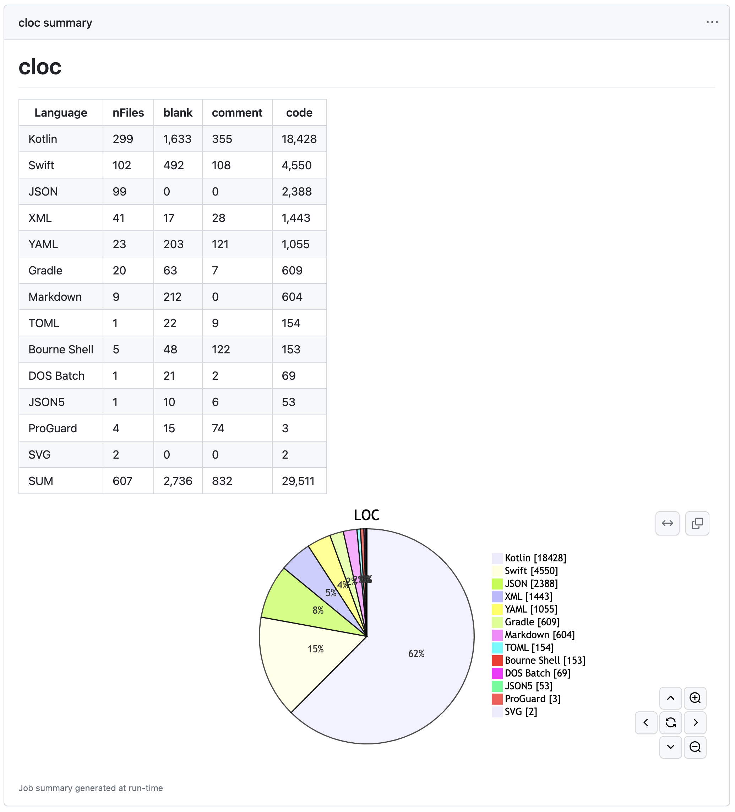

# actions-cloc

cloc を GitHub Actions で実行します。

## クイックスタート

以下をワークフローに追加するだけで、サマリーに結果が表示されます。

```yaml
  - name: actions-cloc
    uses: maxfie1d/actions-cloc@v1
```

[DroidKaigi/conference-app-2023](https://github.com/DroidKaigi/conference-app-2023) で実行した例



## 特徴

* セットアップが簡単です
* 実行にかかる時間はわずか10秒程度です
* 結果をArtifactとしてアップロードして後続のjobで使用することができます
  * 例えば継続的なモニタリングやその他の可視化に使用することができます
* 結果を円グラフで確認できます

## オプション

| Parameter | Description | Default |
| - | - | - |
| artifact | 結果を Artifact としてアップロードします | false |
