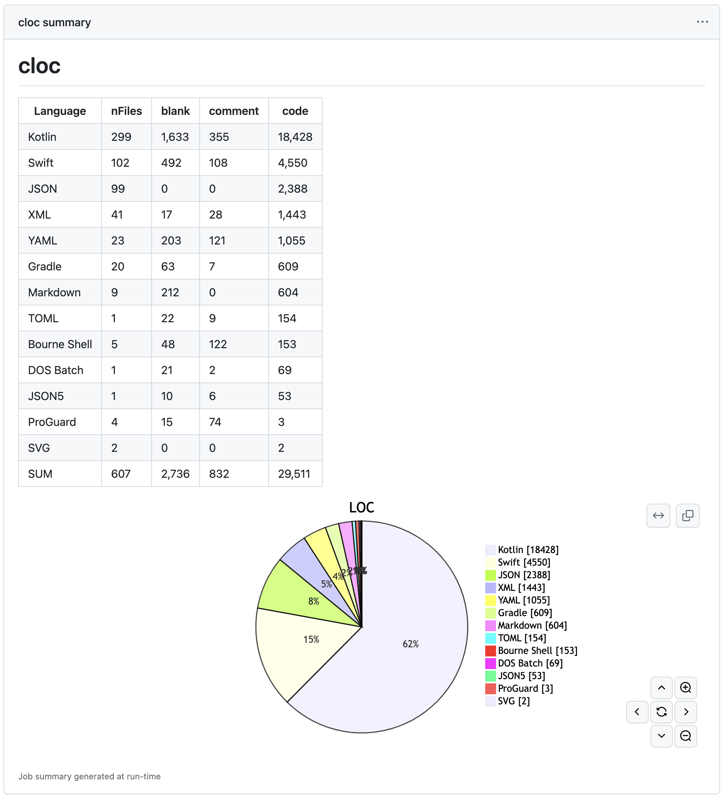

# actions-cloc

Run cloc on GitHub Actions.

[日本語で読む](./README.ja.md)

## Quickstart

Add actions-cloc step to your workflow.

```yaml
  - name: actions-cloc
    uses: maxfie1d/actions-cloc@v1
```

## Example

[DroidKaigi/conference-app-2023](https://github.com/DroidKaigi/conference-app-2023)



## Features

* Easy step
* The execution time is <10s
* Pie chart support
* You can upload the results as an artifact and use it in subsequent steps and jobs
  * For example, it can be used for continuous monitorning and other visualizations.

## Options

| Parameter | Description | Default |
| - | - | - |
| artifact | Upload the results as an artifact | `false` |
| artifact-name | Artifact name | `"cloc-output"` |
